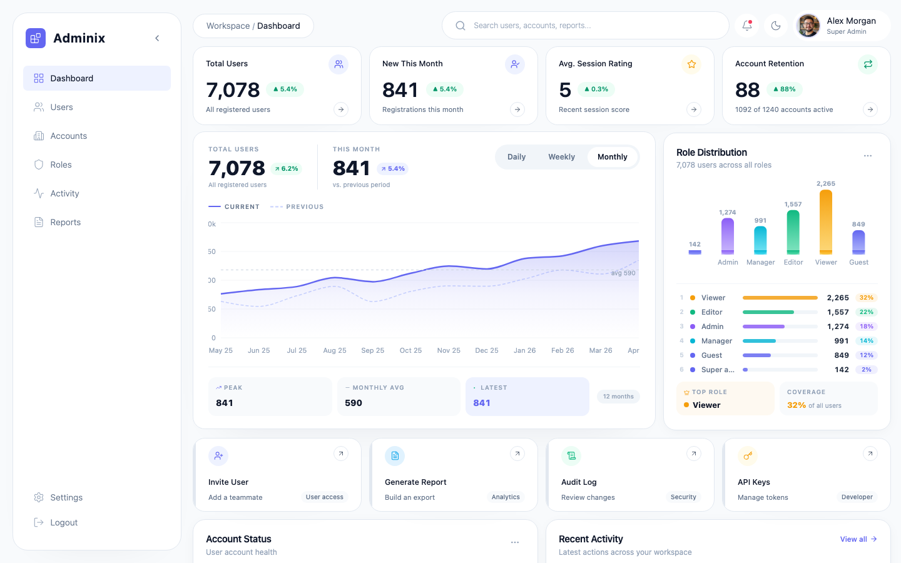

# Adminix

An internal admin dashboard — the kind of tool an ops or support team would use to manage customer accounts, users, roles, and activity logs.

<p align="center">
  
</p>

## Performance

| Metric | Score |
|---|---|
| Performance | 91 |
| Accessibility | 96 |
| Best Practices | 100 |
| SEO | 100 |

---

## What it does

Adminix has 10 mock customer companies and 100,000 users spread across them. The person using this dashboard is an internal Adminix employee — not a customer. They can search and filter the full user list, invite new users with a role and account assignment, suspend or delete users in bulk, read a global audit log, view per-account member lists, and pull reports. Everything is client-side; there's no real backend. MSW intercepts all fetch calls and responds from in-memory seed data.

---

## Stack

| Technology              | Why                                                                                                                                                     |
| ----------------------- | ------------------------------------------------------------------------------------------------------------------------------------------------------- |
| React 19 + TypeScript   | Baseline. Strict mode catches subtle bugs early.                                                                                                        |
| Vite                    | Fast dev server, native ESM, minimal config overhead.                                                                                                   |
| Tailwind CSS v4         | Utility-first makes dark mode and one-off layout adjustments cheap. `class` strategy so the dark toggle is just a classList swap.                       |
| shadcn/ui               | Accessible primitives without a component library lock-in. Copy-paste, own the code.                                                                    |
| TanStack Query          | Handles loading/error/stale states without boilerplate. `placeholderData` keeps the previous page visible during pagination so the layout doesn't jump. |
| Zustand                 | Auth state and UI state (sidebar collapsed, command palette open, theme) live here. Lightweight, no context provider wrapping.                          |
| React Hook Form + Zod   | Zod schema is the single source of truth — form types, validation, and error messages all come from one object.                                         |
| MSW                     | Intercepts at the Service Worker level, so the network tab shows real requests. Handlers live in `src/mocks/` and are never bundled into production.    |
| React Router v6         | Nested routes and `useSearchParams` for URL-as-state on the users page.                                                                                 |
| Recharts                | Good enough for dashboard charts; no need for D3 at this scale.                                                                                         |
| @tanstack/react-virtual | Renders only visible rows for the 100k user list.                                                                                                       |
| Playwright              | E2E tests against a real browser hitting the real dev server.                                                                                           |
| Vitest                  | Unit and integration tests for hooks, utilities, and key component flows.                                                                               |

---

## Running locally

```bash
npm install
npm run dev        # starts Vite + MSW service worker
npm test           # Vitest unit + integration tests
npm run test:e2e   # Playwright E2E (starts dev server automatically)
npm run build      # tsc + vite build
```

The app runs at `http://localhost:5173`. Log in with any email and the password `password`.

---

## Folder structure

```
src/
├── api/          # Plain fetch functions — one file per resource, no framework coupling
├── components/
│   ├── features/ # Domain components (InviteUserModal, RoleMatrix, etc.)
│   ├── layout/   # AppShell, Sidebar, Topbar, ProtectedRoute, CommandPalette
│   └── ui/       # Base components: Button, Modal, Badge, Skeleton, Toast, etc.
├── hooks/        # React Query wrappers (useUsers, useDashboard) + utility hooks
├── lib/          # cn(), theme utilities, error helpers
├── mocks/
│   ├── handlers/ # MSW route handlers — users, accounts, roles, auth, activity
│   └── seeds/    # In-memory seed data: 50 real users, 10 accounts, 5 roles, 200 events
├── pages/        # One directory per route; large pages are split into sub-components
├── stores/       # Zustand: authStore, uiStore, toastStore
└── types/        # Shared interfaces — User, Account, Role, ActivityEvent, AuthUser
e2e/              # Playwright tests: login, search, invite, dark mode, nav
```

---

## Data flow

```
MSW (Service Worker)
  └─ intercepts fetch()
       └─ returns mock JSON
            └─ API layer (src/api/)
                 └─ called by React Query hooks (src/hooks/)
                      └─ data lands in components via useQuery/useMutation
                           ├─ server state cached by React Query
                           └─ UI state (sidebar, modals, theme) in Zustand
```

Mutations follow the same path upward: component calls `mutateAsync`, hook fires the API function, MSW intercepts and updates its in-memory state, React Query invalidates the relevant cache keys, and the UI re-fetches automatically.

---

## Auth flow

1. Login form submits to `POST /api/auth/login`. MSW checks that the password equals `"password"` and returns `{ user, token }`.
2. The `useLogin` hook's `onSuccess` calls `authStore.login(user, token, rememberMe)`.
3. Zustand's persist middleware writes to `localStorage` if "remember me" was checked, otherwise `sessionStorage`. The decision is made at write time — a custom `adaptiveStorage` object checks a separate `adminix-remember-me` flag before routing the write.
4. On every app load, Zustand rehydrates from whichever storage has the key. `ProtectedRoute` reads `isAuthenticated` and redirects to `/login` if it's false.
5. The token is stored in the Zustand state and would attach to outgoing requests via an `Authorization: Bearer` header in a real app. In this demo, MSW doesn't validate the header — the auth check is client-side only.
